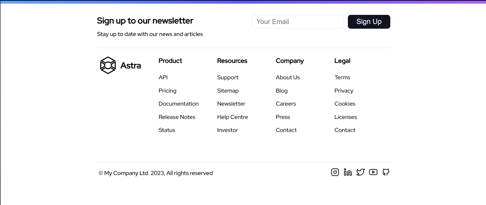

A Pen created on Vinishireis

In the realm of web development, a responsive footer is a crucial element that enhances the user experience across various devices. A footer, typically located at the bottom of a webpage, contains essential information, links, and often serves as a navigation aid. Ensuring its responsiveness is vital to accommodate the diverse screen sizes and resolutions of devices ranging from desktops to smartphones.

